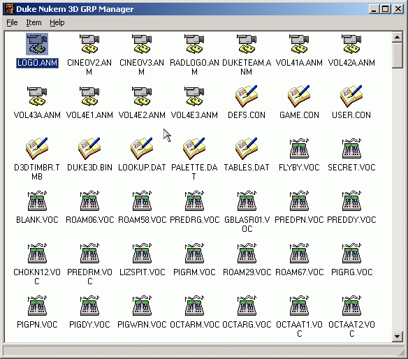

## Duke Nukem 3D GRP Manager

### Description

This code is provides a Win32 environment for the editing of Duke Nukem 3D GRP files (which stores all the levels/sounds/gfx for the game). I wrote it in a couple of days, it seems to work fine. It demonstrations some pretty basic file editing. Worth a look
 
### More Info
 

             |
---                |---
**Submitted On**   |2002-11-11 03:52:04
**By**             |[JimCamel](https://github.com/Planet-Source-Code/PSCIndex/blob/master/ByAuthor/jimcamel.md)
**Level**          |Intermediate
**User Rating**    |5.0 (15 globes from 3 users)
**Compatibility**  |VB 5\.0, VB 6\.0
**Category**       |[Games](https://github.com/Planet-Source-Code/PSCIndex/blob/master/ByCategory/games__1-38.md)
**World**          |[Visual Basic](https://github.com/Planet-Source-Code/PSCIndex/blob/master/ByWorld/visual-basic.md)
**Archive File**   |[DN3D\_GRP\_M14952711112002\.zip](https://github.com/Planet-Source-Code/jimcamel-duke-nukem-3d-grp-manager__1-40603/archive/master.zip)

